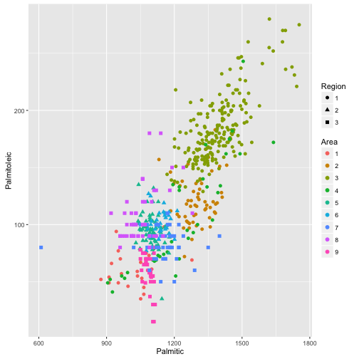

Olive oil: correlations and clustering app
========================================================
author: Federico Calore
date: 22 December 2015
font-import: https://fonts.googleapis.com/css?family=Open+Sans:400italic,700italic,400,700
font-family: 'Open Sans'
transition: linear

First Slide
========================================================

- Bullet 1
- Bullet 2
- Bullet 3

GGplot scatter
========================================================
transition: zoom


 

Clusters of observations
========================================================


```r
km <- kmeans(olive[3:10], centers = 3)
```

<small>1079.8920455, 1384.8490566, 1200.5815217, 78.1647727, 176.490566, 113.875, 236.25, 216.8113208, 235.6902174, 7812.6988636, 6890.740566, 7317.6521739, 697.1477273, 1197.9716981, 1001.0543478, 28.1534091, 34.0754717, 32.9402174, 46.8977273, 62.5377358, 63.6956522, 10.0681818, 22.4245283, 15.1467391</small>

Conclusions
========================================================
incremental: true
