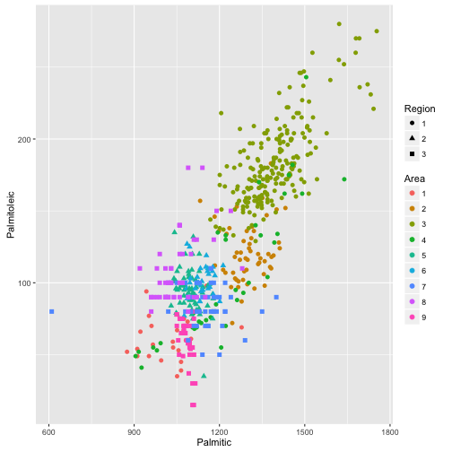

Olive oil: correlations and clustering app
========================================================
author: Federico Calore
date: 22 December 2015
font-import: https://fonts.googleapis.com/css?family=Open+Sans:400italic,700italic,400,700
font-family: 'Open Sans'
transition: linear

Italian Olive Oil clustering
========================================================

#### Dataset


```r
library(pgmm); data(olive)
```

**Italian Olive Oil**: 
<small>Data on the percentage composition of eight fatty acids found by 
lipid fraction of 572 Italian olive oils. The data come from three 
regions and a number of different areas.</small>

#### Clustering app
<small>Using *clustering*, we want to investigate the relationship between the
data variables and the region/area of origin of the oils.
The app dynamically generates **k clusters** (with the *kmeans* algorithm)
using the 8 data variables. The clusters groupings can be plotted along with
the other variables (as *colors* or *shapes*) in the scatter plot.
We would like to build clusters similar to the region (n = 3) or area (n = 10)
factor levels.</small>

GGplot scatter
========================================================
transition: zoom


<small>The scatterplot is dynamically generated and can be used for exploratory
analysis on the dataset:


```r
ggplot(data = olive, aes_string(x = "Palmitic", y = "Palmitoleic")) +
  geom_point(size = 2) +
  aes_string(color = "Area") +
  aes_string(shape = "Region")
```
</small>

***

 

Control Panel
========================================================

<small>The user can select the variables to be plotted and
the number of clusters to be generated:</small>


***


Clusters of observations
========================================================

</small>The number of clusters default to k = 3, but can be changed with the
control slider</small>


```r
km <- kmeans(olive[3:10], centers = 3)
```

<small>The table below the plot shows the cluster sizes and their centers; the
table can be sorted by any of the columns: </small>


